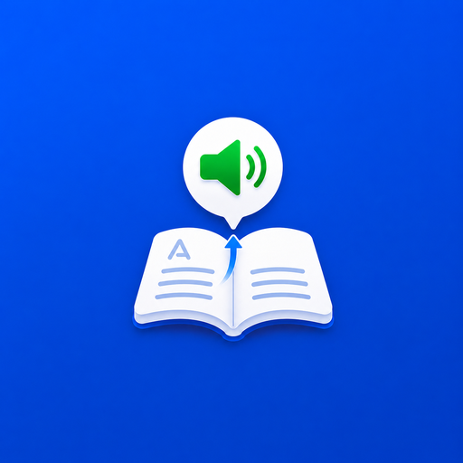

<div align="center">
  

  <h1>LePraMim</h1>

  <p><strong>O celular lê textos em voz alta para quem precisa ouvir.</strong></p>

  <p>
    <a href="https://pascoal.eti.br/lepramim/"></a>
    
    
    
  </p>

  <p>
    <a href="mailto:devs@pascoal.eti.br"></a>
    <a href="https://pascoal.eti.br/lepramim/privacidade"></a>
    <a href="https://pascoal.eti.br/lepramim/termos"></a>
    
  </p>

  <p>
    <a href="https://pascoal.eti.br/lepramim/">Site oficial</a> ·
    <a href="mailto:devs@pascoal.eti.br">Suporte</a> ·
    <a href="https://pascoal.eti.br/lepramim/privacidade">Privacidade</a> ·
    <a href="https://pascoal.eti.br/lepramim/termos">Termos</a>
  </p>
</div>

## O que é

App Android nativo em Java para acessibilidade. O LePraMim lê textos em voz alta para pessoas com baixa alfabetização, idosos e pessoas com dificuldade de leitura.

## Produto

O fluxo principal não é a câmera. A câmera é importante, mas secundária.

O foco do app é ajudar a pessoa quando ela recebe texto no próprio celular:

1. O familiar/cuidador instala e configura.
2. O cuidador ativa o Serviço de Acessibilidade.
3. A pessoa abre WhatsApp, SMS, Gmail, navegador ou outro app.
4. Ela toca no botão amarelo OUVIR.
5. O LePraMim lê e, quando configurado, explica o texto em palavras simples.

## Implementado

- App Android nativo em Java.
- Onboarding com modo cuidador/familiar e modo usuário.
- Botões grandes, alto contraste e português do Brasil.
- Text-to-Speech com preferência por voz pt-BR.
- Ajustes de velocidade e tom de voz.
- Serviço de Acessibilidade.
- Botão flutuante arrastável com posição salva.
- Toque simples para ler, toque duplo para repetir e segurar para parar.
- Leitura inteligente local com `SmartReadingEngine`.
- Detecção de boleto, valor, vencimento, consulta, entrega, código, senha, PIX, banco, link suspeito e golpe.
- Modo Seguro ligado por padrão.
- OCR com ML Kit para foto/print.
- Google Play Billing com mensal e anual.
- `BillingRepository` e `EntitlementManager`.
- Backend preparado em `/server` para validação de assinatura.
- Documentação de Play Store em `/docs`.
- Testes unitários para leitura inteligente e limite do plano grátis.

## Produtos esperados na Play Console

- Mensal: `lepramim_plus_monthly`
- Anual: `lepramim_plus_annual`

## Rodar build

Use o Gradle Wrapper incluído no projeto:

```powershell
.\gradlew.bat :app:assembleDebug
```

## Testes

```powershell
.\gradlew.bat :app:testDebugUnitTest
```

## Release

```powershell
.\gradlew.bat :app:bundleRelease
```

Para gerar release assinado, crie `keystore.properties` localmente a partir de `keystore.properties.example`. Nunca versionar senha, keystore ou token.

Arquivos sensíveis ficam fora do versionamento:

- `keystore.properties`
- `keystore/*.jks`
- `server/.env`

## Documentação importante

- `docs/audit.md`
- `docs/play-store-accessibility.md`
- `docs/privacy.md`
- `docs/test-plan.md`
- `docs/release-checklist.md`
- `docs/play-store-copy.md`

## Configurações externas pendentes

- Produtos de assinatura ativos na Play Console.
- Teste fechado/produção conforme regra do Google Play.
- Backend HTTPS para validar `purchaseToken`.
- Conta de serviço da Google Play Developer API.
- URL real em `BuildConfig.ENTITLEMENT_BASE_URL`.

Nenhuma chave, token, keystore ou credencial deve ser colocada no código.
